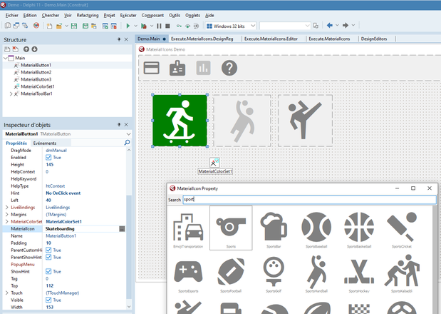
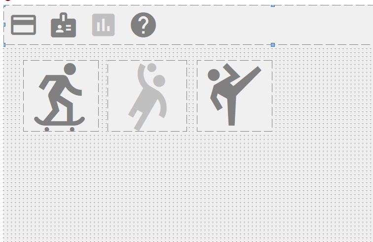
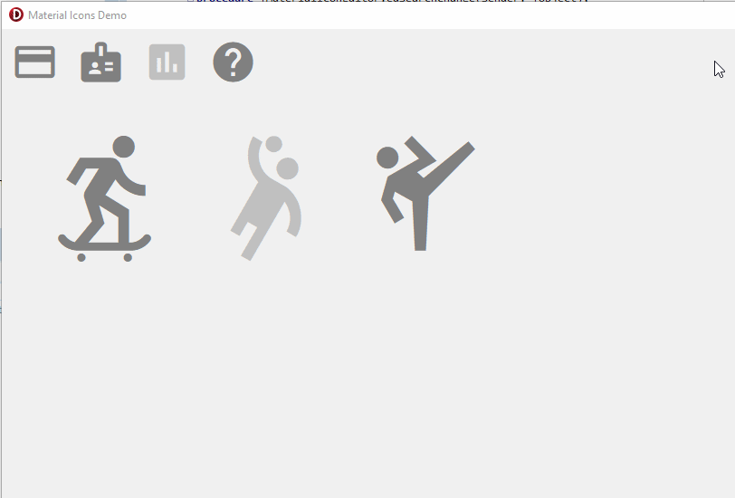

# MaterialioForDelphi
Use Google's Material io TTF Font for VCL Components

## Installation

1. Open the ProjectGroup
2. Compile Execute.MaterialIcons.bpl
3. Build Execute.MaterialIcons.Design.bpl (Compile will fail !)
4. Install Execute.MaterialIcons.Design.bpl
5. Open and test Demo.dpr

Note that the MaterialIcon property is of type TMaterialIcon, this type do not have any RTTI, so Delphi IDE can't display it. 
To bypass this problem, at design time only {$IFDEF DESIGN_ONLY} the propery is define as a WideChar, hence the Build required for the design time package.
In fact, TMaterialIcon is a WideChar, but the enumeration take only the valid chars for the Material Icons font.
In your code you can change the property like this for instance "MaterialButton1.MaterialIcon := TMaterialIcon.Search".

## Components

TMaterialButton can display one the of Material Icon like a picture if you don't define the OnClick event.
if you define the OnClick event it acts like a TSpeedButton (see TMaterialColorSet for colors)

TMaterialToolBar is just a collection of TMaterialToolButton to quickly define a toolbar.
If the AutoSize property is set, the buttons are resized to fit the toolbar height.

TMaterialColorSet defines the colors of the border, the background and the icon of a "Material" component in 4 different states: Default, Hover, Down and Disabled.
Instead of defining the color of each component individually, you can define few color sets and apply them as needed with the MaterialColorSet property.

With the MaterialIcon property Editor you can display all the availables Icons and search in the collection by name.

